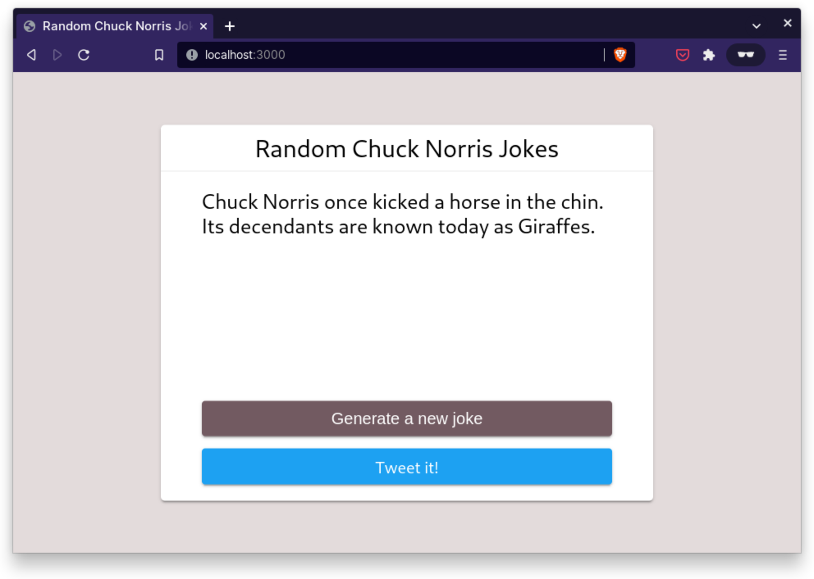

# Random Chuck Norris Jokes

**Tutorial**: [How to Deploy Node.js Applications with Docker](https://betterstack.com/community/guides/scaling-nodejs/dockerize-nodejs/).



## 🟢 Prerequisites

You must have Node.js and `npm` installed on your machine. This project was
built against the following versions:

- Node.js v16.14.0.
- npm v8.3.1.

## 📦 Getting started

- Clone this repo to your machine:

```shell
git clone https://github.com/betterstack-community/chucknorris
```

- `cd` into the project folder and run `npm install` to download dependencies.
- Execute the command below to start the development server:

```shell
npm start
```

- Visit http://localhost:3000 in your browser.

## ⚖ License

The code used in this project and in the linked tutorial are licensed under the
[Apache License, Version 2.0](LICENSE).
